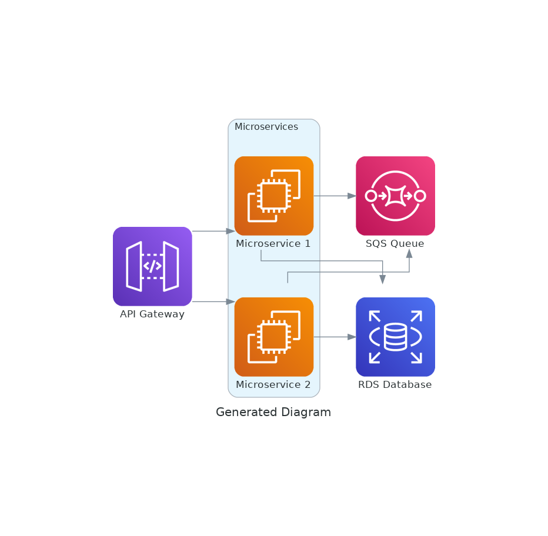

# 🧠 Diagram Agent — AWS Architecture Generator via Chat

An intelligent agent powered by OpenAI that interacts with the user via WebSocket chat and generates AWS architecture diagrams based on natural language descriptions. Diagrams are visualized using the [diagrams](https://diagrams.mingrammer.com/) library.

## ⚙️ Features

- Support for popular AWS components: EC2, RDS, S3, Lambda, ALB, etc.
- WebSocket chat with OpenAI-powered LLM agent and tool calling
- Iterative refinement with follow-up questions
- Automatic PNG diagram rendering from JSON spec
- Lightweight frontend UI to visualize the result and talk to the agent

---

## 📸 Example

1. User says:
Create an architecture with API Gateway, an SQS queue, two EC2 instances, and an RDS database.
2. Agent responds with clarifying questions (e.g., naming services) and then provides the updated diagram.
3. Diagram result:



---
## 🚀 Quick Start with Docker

### 1. Clone the repository

```bash
git clone https://github.com/sadbarmaglot/diagram_agent.git
cd diagram_agent
```
### 2. Create .env file
```
OPENAI_API_KEY=sk-...
```
### 3. Start the application
```
docker-compose up --build
```
### 4. Open in your browser
```
http://localhost:8000/static/index.html
```
## 🧠 Architecture
```
User <-> Web UI (HTML/JS)
     <-> WebSocket API (FastAPI)
         <-> DiagramAgent (OpenAI GPT + tool calls)
             ├── generate_diagram (returns JSON of components and links)
             └── build_diagram() — renders diagram with `diagrams` library
                 └── ask_for_clarification (follow-up questions)
```
## 🗂️ Project Structure
```
.
├── static/
│   └── index.html         # Chat-based frontend
│   └── chat.js            # JS for chat 
│   └──diagram.png         # Output diagram
├── .env                   # Environment variables (not committed)
├── .gitignore
├── __init__.py
├── agent.py               # Core logic for LLM agent
├── diagram_tools.py       # Diagram generation logic
├── docker-compose.yml     
├── Dockerfile
├── main.py                # FastApi app
├── prompt.py              # System prompt for the assistant
├── requirements.txt       # Python dependencies
└── settings.py            # Tools and model's parameters
```